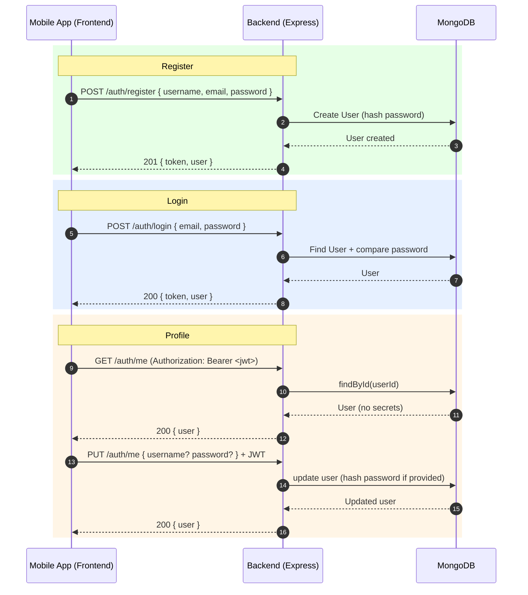
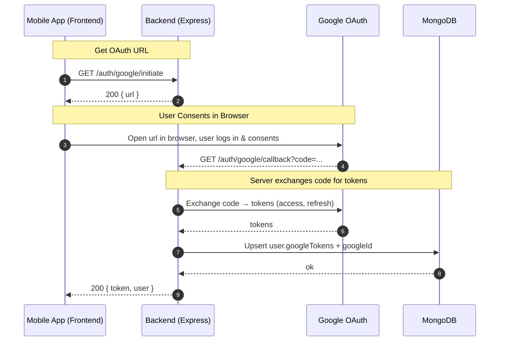
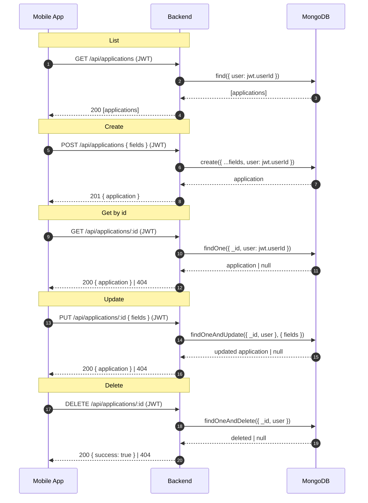
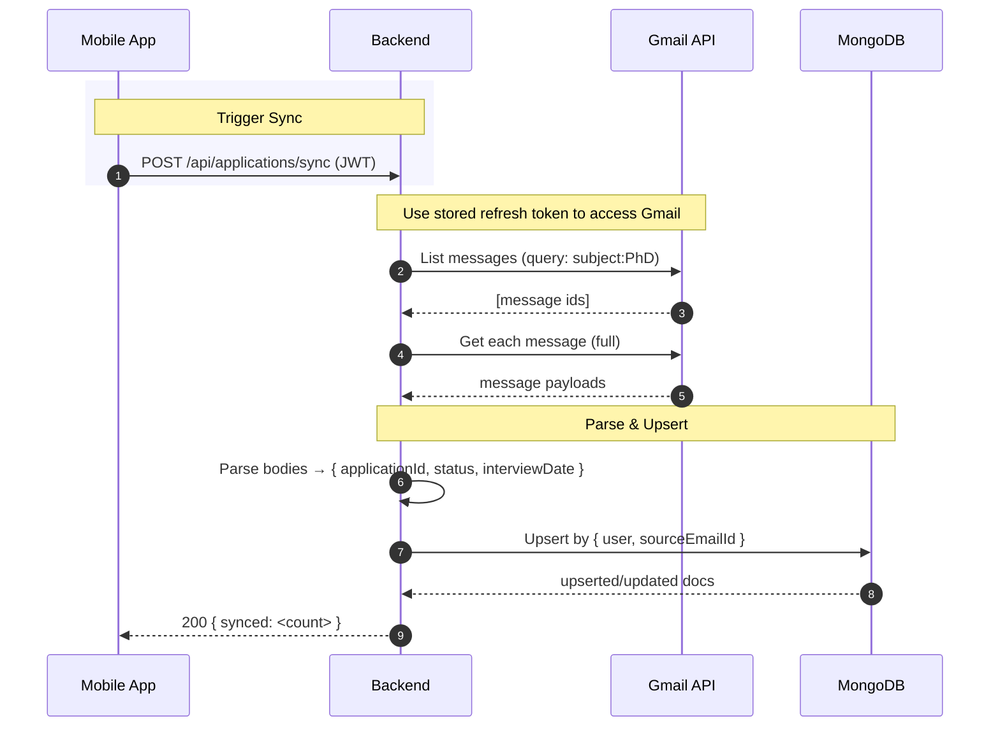

# Frontend ↔ Backend Flow Diagram and API Sequence

This document visualizes how the mobile frontend interacts with the backend APIs, Google OAuth, Gmail, and MongoDB. It also enumerates the request/response of each step for quick reference while building the UI.

- Backend app entry: `server.js`
- Routes:
  - Auth: `src/routes/auth.js`
  - Applications: `src/routes/api.js`
- Controllers:
  - `src/controllers/userController.js`
  - `src/controllers/applicationController.js`

---

## 1) Local Auth (Register/Login) + Profile

### Requests / Responses
- POST `/auth/register`
  - Req: `{ username, email, password }`
  - Res: `201 { token, user }`
- POST `/auth/login`
  - Req: `{ email, password }`
  - Res: `200 { token, user }`
- GET `/auth/me` (JWT)
  - Res: `200 { user }`
- PUT `/auth/me` (JWT)
  - Req: `{ username? password? }`
  - Res: `200 { user }`

---

## 2) Google OAuth Link (Gmail Read-Only Consent)

### Requests / Responses
- GET `/auth/google/initiate`
  - Res: `200 { url }` (open in browser)
- GET `/auth/google/callback?code=...`
  - Res: `200 { token, user }`

---

## 3) Applications – CRUD

### Requests / Responses
- GET `/api/applications` (JWT) → `200 [ { ...app } ]`
- POST `/api/applications` (JWT) → `201 { ...app }`
- GET `/api/applications/:id` (JWT) → `200 { ...app } | 404`
- PUT `/api/applications/:id` (JWT) → `200 { ...app } | 404`
- DELETE `/api/applications/:id` (JWT) → `200 { success: true } | 404`

---

## 4) Gmail Sync – Import Applications from Emails

### Request / Response
- POST `/api/applications/sync` (JWT)
  - Res: `200 { synced: number }`
  - Errors: `400` if Google not linked; `401` if missing JWT

---

## 5) High-Level User Journeys

- Onboarding (Local Auth)
  1. Register/Login → save JWT
  2. Fetch profile `/auth/me`
  3. Manually create or list applications

- Gmail-based Import
  1. Initiate OAuth `/auth/google/initiate` → open URL
  2. Handle callback `/auth/google/callback` → store returned JWT
  3. Trigger sync `/api/applications/sync`
  4. Show updated list `/api/applications`

---

## Error Handling & Security
- All protected routes require `Authorization: Bearer <jwt>`.
- Common errors: `401 Unauthorized`, `404 Not Found`, `500 Internal Server Error`.
- Global error handler: `src/middleware/errorHandler.js`.
- Tokens valid for 7 days, issued on register/login/google-callback.

---

## Notes for Frontend Implementation
- Keep `jwt` in secure storage (Keychain/Keystore/Secure Storage).
- Always set `Content-Type: application/json` for JSON bodies.
- Handle 401 by redirecting to login and clearing stored token.
- During Google OAuth, you’ll open a browser (custom tab/SafariViewController) to complete consent.
